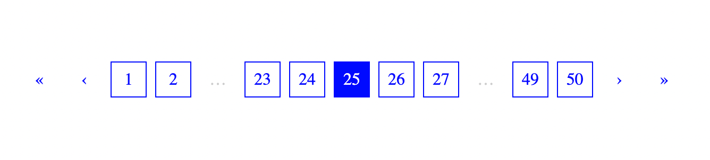

[](https://codepen.io/bramus/pen/NWaxNKQ)

# JavaScript Pagination Sequence Generator

Generate a sequence of numbers for use in a Pagination Component, the clever way.

## Installation

```bash
npm i @bramus/pagination-sequence
```

## Usage / Example

This library comes as an ES Module and exposes a function/algorithm to generate an array of pagination entries.

```js
import { generate } from '@bramus/pagination-sequence';

const sequence = generate(67, 74);
// ~> [1, 2, '…', 65, 66, 67, 68, 69, '…', 73, 74]
```

Alternatively you can use `generateFromObj` which accepts a configuration Object as an argument:

```js
import { generateFromObj } from '@bramus/pagination-sequence';

const sequence = generateFromObj({
    curPage: 67,
    numPages: 74,
});
// ~> [1, 2, '…', 65, 66, 67, 68, 69, '…', 73, 74]
```

Note that this is a Framework Agnostic library: the generated array is not rendered in any way but, instead, must be fed into your own Pagination Component for rendering.

💡 Looking for some Pagination Component inspiration? See [Integration Examples](#integration-examples) below to see how to use this with the JavaScript Framework Du Jour™.

## API

### `generate()`

The exposed `generate` function has the following API:

```js
generate(curPage, numPages, numPagesAtEdges = 2, numPagesAroundCurrent = 2, glue = '…');
```

Parameters:

- `curPage`: The current active page
- `numPages`: The total number of pages
- `numPagesAtEdges` _(default: 2)_: Number of pages to show on the outer edges.
- `numPagesAroundCurrent` _(default: 2)_: Number of pages to show around the active page.
- `glue` _(default: '…')_: The string to show when there's a gap

### `generateFromObj()`

The `generateFromObj` function accepts one single `opts` object. Its members are all of the parameters described above. Default values are set where possible.

```js
const { 
    curPage = 1,
    numPages = 1,
    numPagesAtEdges = 2,
    numPagesAroundCurrent = 2,
    glue = '…',
} = opts;
```

## Principles

The algorithm is opinionated and follows these principles:

- **Stable Output**

  When generating a sequence, it will always generate the same amount of entries, for any `curPage` value. When viewing a page at the edge of a series, this can result in `numPagesAtEdges` being ignored.

  For example: Instead of having `generate(2, 12, 1, 1)` return `01-[02]-03-..-12` _(5 entries)_, it will return `01-[02]-03-04-05-..-12` _(7 entries)_. This is a deliberate choice because `generate(7, 12, 1, 1)` will also return 7 entries: `01-..-06-[07]-08-..-12`.

  With a stable amount of entries being generated, the output will also be visually stable when rendered on screen.

- **Always include links to the edges**

  The algorithm will always include links to the first and last page.

  For Example: when looking at page 25 of 50, the algorithm will include a link to page 1 and page 50.

- **No unnecessary gaps**

  When the algorithm detects a gap that's only “1 item wide”, it will replace that gap with the actual number.

  For Example: A foolish take on `generate(4, 9, 1, 1)`, would generate `01-..-03-[04]-05-..-09`. The algorithm corrects the first gap to `02` and will return `01-02-03-[04]-05-..-09` instead.

## Integration Examples

### React

🔗 Try it online: [https://codepen.io/bramus/pen/NWaxNKQ](https://codepen.io/bramus/pen/NWaxNKQ)

```jsx
import React from "react";
import ReactDOM from "react-dom";
import { generate } from "@bramus/pagination-sequence";

const BASE_URL = '#';

const PaginationEntry = ({ value, onEntryClick = null, label = null, title = null, isCurrent = false, isDisabled = false, ...props }) => {
    label ??= value;
    title ??= `Go to page ${value}`;

    const onClick = (e) => {
        e.stopPropagation();
        e.preventDefault();
        
        e.target.blur();
        
        if (onEntryClick) {
            onEntryClick(value);
        }
    }
        
    if (value == '…') {
        return (
            <li data-pagination-ellipsis {...props}><span>{label}</span></li>
        );
    }

    if (isDisabled) {
        return (
            <li data-pagination-disabled {...props}><span>{label}</span></li>
        );
    }

    if (isCurrent) {
        props['data-pagination-current'] = true;
    }

    return (
        <li {...props}>
            <a href={`${BASE_URL}/page/${value}`} title={title} onClick={onClick}>{label}</a>
        </li>
    );
}

const Pagination = ({ curPage, numPages, numPagesAtEdges = 2, numPagesAroundCurrent = 2, onEntryClick = null }) => {
    const sequence = generate(curPage, numPages, numPagesAtEdges, numPagesAroundCurrent);
    // console.log(sequence);

    return (
        <ul className="pagination">
            <PaginationEntry data-pagination-first onEntryClick={onEntryClick} value={1} title="Go to First Page" label="&laquo;" isDisabled={curPage === 1} />
            <PaginationEntry data-pagination-prev onEntryClick={onEntryClick} value={curPage-1} title="Go to Previous Page" label="&lsaquo;" isDisabled={curPage === 1} />
            {sequence.map((val, idx) => 
                <PaginationEntry key={`page-${(val == '…') ? `…-${idx}` : val}`} onEntryClick={onEntryClick} value={val} isCurrent={val == curPage} />
            )}
            <PaginationEntry data-pagination-next onEntryClick={onEntryClick} value={curPage+1} title="Go to Next Page" label="&rsaquo;" isDisabled={curPage === numPages} />
            <PaginationEntry data-pagination-next onEntryClick={onEntryClick} value={numPages} title="Go to Last Page" label="&raquo;" isDisabled={curPage === numPages} />
        </ul>
    );
}

ReactDOM.render(
    <Pagination curPage={25} numPages={50} onEntryClick={(val) => { console.log(val)}} />,
    document.getElementById('root')
);
```
## License

`@bramus/pagination-sequence` is released under the MIT public license. See the enclosed `LICENSE` for details.

## Other Language Implementations

Looking for an implementation in another programming language?

- PHP: [https://gist.github.com/bramus/5d8f2e0269e57dff5136](https://gist.github.com/bramus/5d8f2e0269e57dff5136) _(The original, from 2014)_
- _(submit a PR to add your own)_
